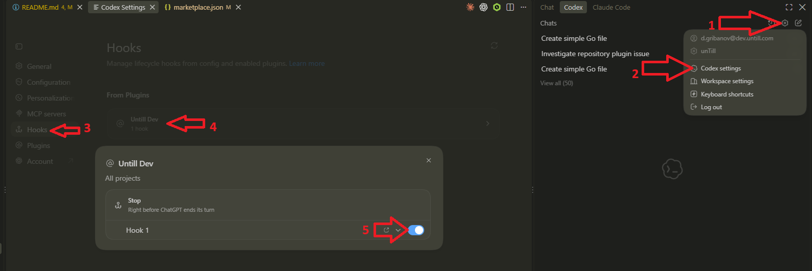

# ai-plugins

`untill-dev` automates unTill development workflows.

## Header comment corrector

After each agent response, a `Stop` hook inserts or repairs headers in untracked and newly added source files. It leaves committed files unchanged and does not stage repairs.

It requires Git, Python 3.8+, and a configured Git `user.name`.

See the [full documentation](untill-dev/README.md#header-comment-corrector) for supported formats, exclusions, and manual repair. Run its tests with `python -m unittest discover -s untill-dev/tests -v`.

## Installation

1. Install the plugin globally:

```shell
codex plugin marketplace add https://github.com/untillpro/ai-plugins.git
codex plugin add untill-dev@untill-ai-plugins
```

2. Trust the plugin hook:

codex settings -> Hooks -> From Plugins -> untill-dev -> enable Stop hook



The plugin is hardcoded to operate only when the repository's GitHub `origin` belongs to the
`untillpro` or `voedger` organization. It does nothing in all other repositories.

3. Restart Codex VSCode extension

## Deinstallation

```shell
codex plugin remove untill-dev@untill-ai-plugins
codex plugin marketplace remove untill-ai-plugins
```

## Links

- [custom agents](https://learn.chatgpt.com/docs/agent-configuration/subagents)
- [plugin configuration](https://learn.chatgpt.com/docs/config-file/config-reference)
- [hook trust](https://learn.chatgpt.com/docs/hooks).
